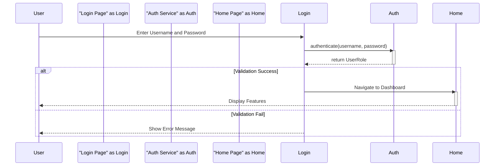
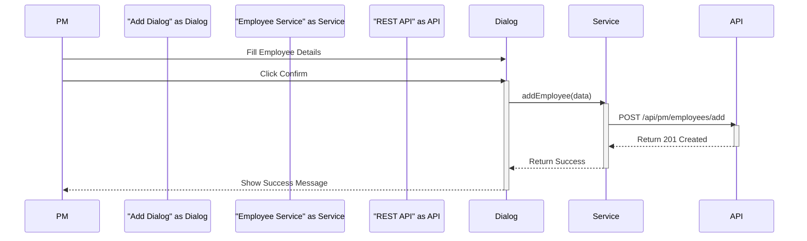
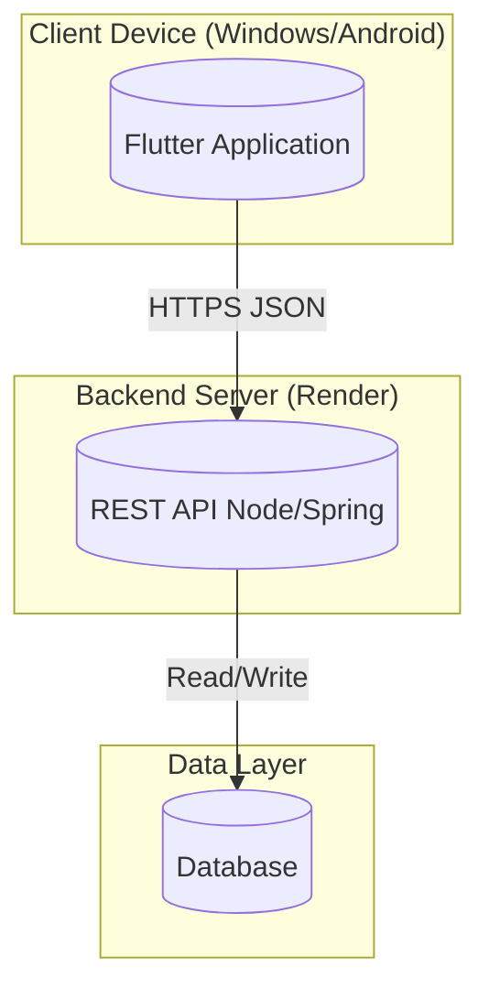

# Chapter 2: Modeling

## 1. Introduction
This chapter presents the static and dynamic views of the system using Unified Modeling Language (UML) diagrams.

## 2. Use Case Diagram
The following diagram illustrates the interactions between the primary actors (PM, Agent, Archiver) and the system's main use cases.

```mermaid
usecaseDiagram
    actor "PM (Project Manager)" as PM
    actor "Agent" as Agent
    actor "Archiver" as Archiver

    package "HR Management System" {
        usecase "Login" as UC1
        usecase "Manage Employees" as UC2
        usecase "Add Employee" as UC3
        usecase "Modify Employee" as UC4
        usecase "View Departments" as UC5
        usecase "Manage Bodies" as UC6
        usecase "Request Retirement" as UC7
        usecase "View Archives" as UC8
    }

    PM --> UC1
    PM --> UC2
    PM --> UC3
    PM --> UC4
    PM --> UC5
    PM --> UC6
    PM --> UC7

    Agent --> UC1
    Agent --> UC2
    Agent --> UC4
    Agent --> UC5

    Archiver --> UC1
    Archiver --> UC5
    Archiver --> UC8

    UC3 ..> UC2 : extends
    UC4 ..> UC2 : extends
```

## 3. Class Diagram
This diagram represents the internal structure of the system, matching the actual data models implemented in the Flutter code (`lib/classes/`).

```mermaid
classDiagram
    %% Enums
    class Status {
        <<enumeration>>
        employed
        toRetire
        retired
    }

    class UserRole {
        <<enumeration>>
        pm
        agent
        archiver
    }

    %% Classes
    class Employee {
        +String id
        +String fullName
        +String rank
        +String category
        +String specialty
        +String department
        +Status status
        +DateTime requestDate
        +String gradeEn
        +String gradeAr
        +int step
        +int departmentId
        +int specialityId
        +Employee(id, fullName, ...)
        +fromJson(json)
        +toJson()
    }

    class Department {
        +String id
        +String name
        +String headName
        +int totalStaffMembers
        +List~Employee~ employees
        +Department(id, name, ...)
        +fromJson(json)
    }

    class Body {
        +String id
        +String nameEn
        +String nameAr
        +int totalMembers
        +List~Employee~ employees
    }

    %% Relationships
    Department "1" has "*" Employee : contains
    Body "1" has "*" Employee : contains
    Employee ..> Status : uses
```

## 4. Sequence Diagrams

### 4.1 Authentication Process
Sequence diagram for the login flow utilizing `AuthService`.



### 4.2 Add Employee Process
Sequence diagram for adding a new employee involving the `EmployeeService` and REST API.



## 5. Deployment Diagram
Illustrates the physical architecture of the system.


