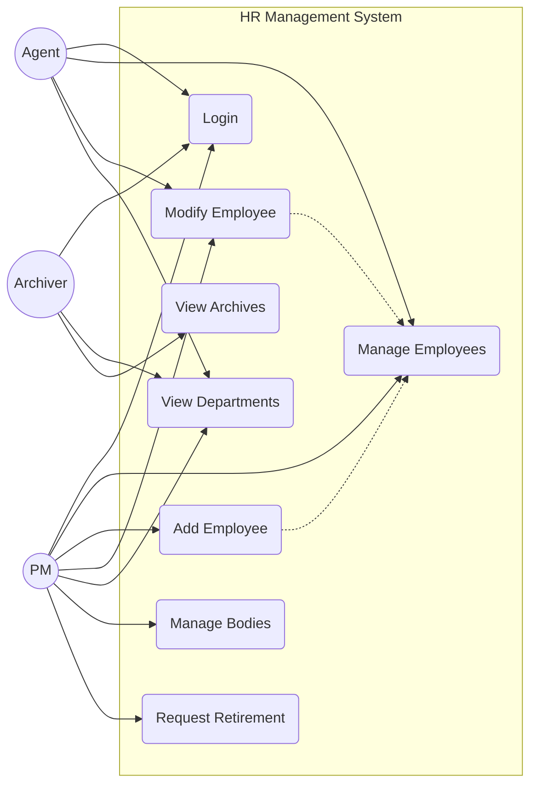
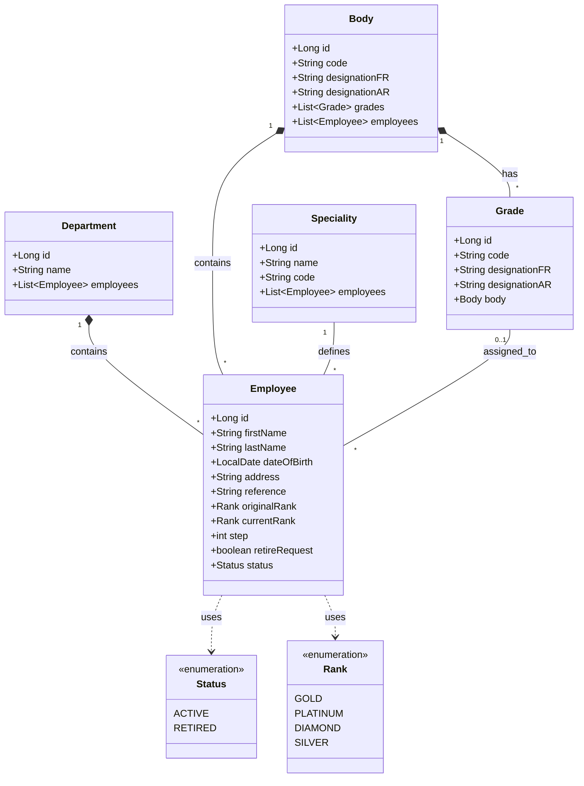
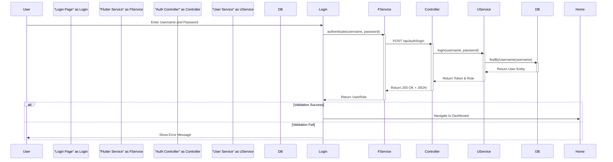
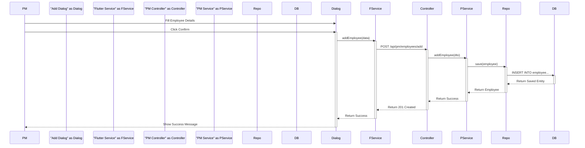
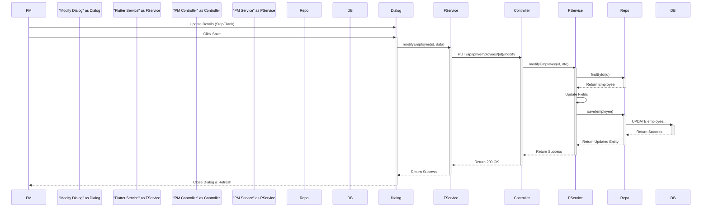
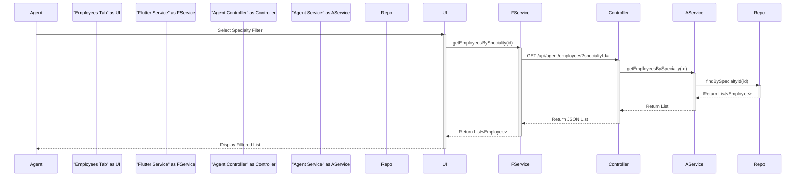
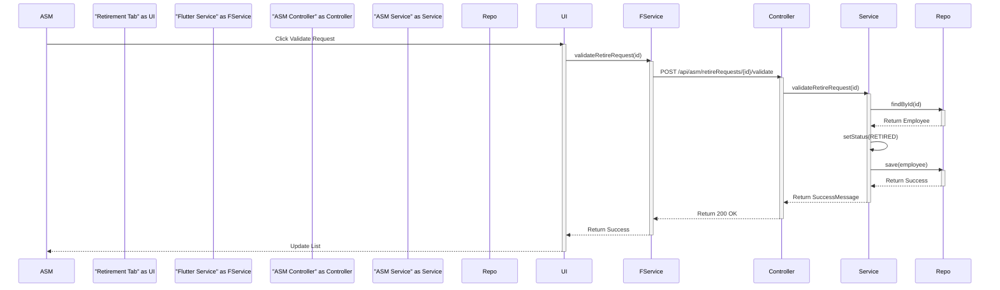
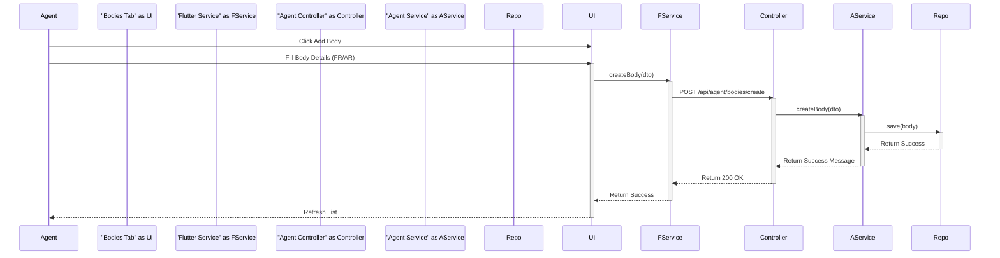
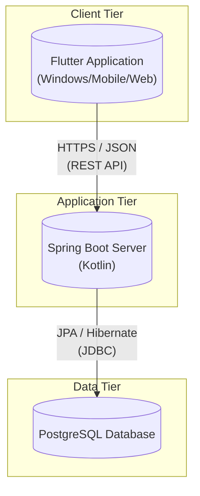

# Chapter 2: Modeling

## 1. Introduction
This chapter presents the static and dynamic views of the system using Unified Modeling Language (UML) diagrams.

## 2. Use Case Diagram
The following diagram illustrates the interactions between the primary actors (PM, Agent, Archiver) and the system's main use cases.

## 3. Class Diagram
This diagram represents the internal structure of the system, matching the Spring Boot entities (`hr-server/src/main/kotlin/com/gl/hr/server/models/`).

## 4. Sequence Diagrams

### 4.1 Authentication Process
Sequence diagram for the login flow utilizing `AuthService` connecting to the Spring Boot backend.

### 4.2 Add Employee Process
Sequence diagram for adding a new employee involving the Flutter client and Spring Boot backend layers.

### 4.3 Modify Employee Process (PM)
Sequence diagram for updating an existing employee's details (e.g., promotion).

### 4.4 Search Employees by Specialty (Agent)
Sequence diagram for an Agent filtering employees by functionality.

### 4.5 Validate Retirement Request (ASM)
Sequence diagram for the validation of a retirement request.

### 4.6 Create Body (Agent)
Sequence diagram for an Agent creating a new organizational body.

## 5. Deployment Diagram
Illustrates the physical architecture of the system including the Spring Boot backend and PostgreSQL database.

