# Chapter 2: Modeling

## 1. Introduction
This chapter presents the static and dynamic views of the system using Unified Modeling Language (UML) diagrams.

## 2. Use Case Diagram
The following diagram illustrates the interactions between the primary actors (PM, Agent, Archiver) and the system's main use cases.

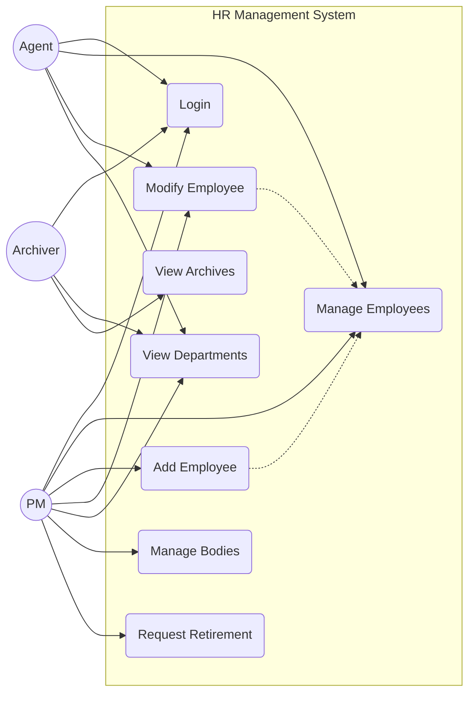

## 3. Class Diagram
This diagram represents the internal structure of the system, matching the Spring Boot entities (`hr-server/src/main/kotlin/com/gl/hr/server/models/`).

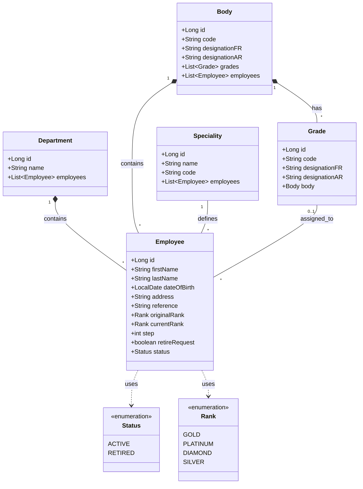

## 4. Sequence Diagrams

### 4.1 Authentication Process
Sequence diagram for the login flow utilizing `AuthService` connecting to the Spring Boot backend.

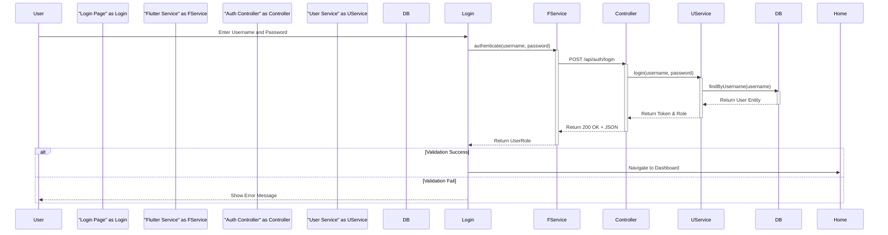

### 4.2 Add Employee Process
Sequence diagram for adding a new employee involving the Flutter client and Spring Boot backend layers.

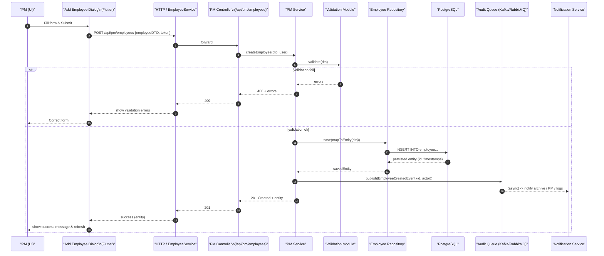

### 4.3 Modify Employee Process (PM)
Sequence diagram for updating an existing employee's details (e.g., promotion).

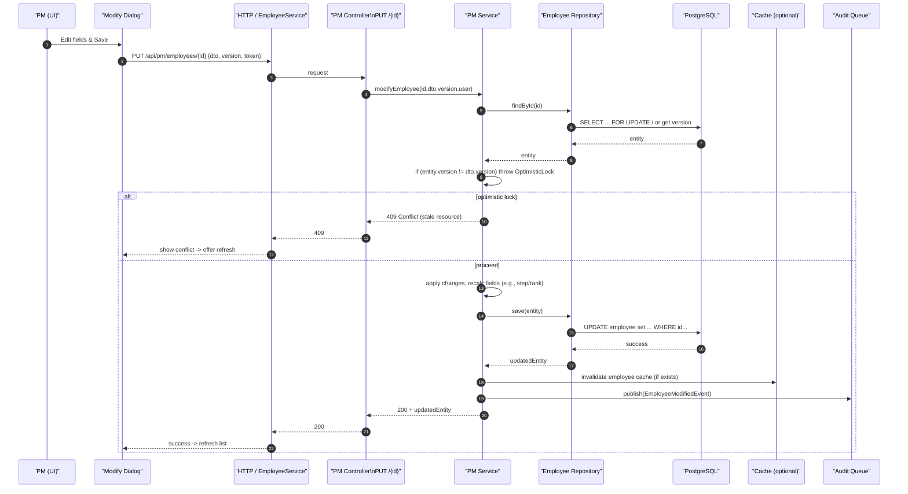

### 4.4 Filter & Search Employees (Client-Side)
Sequence diagram for the client-side filtering of employees (Search, Department, Rank, Status).

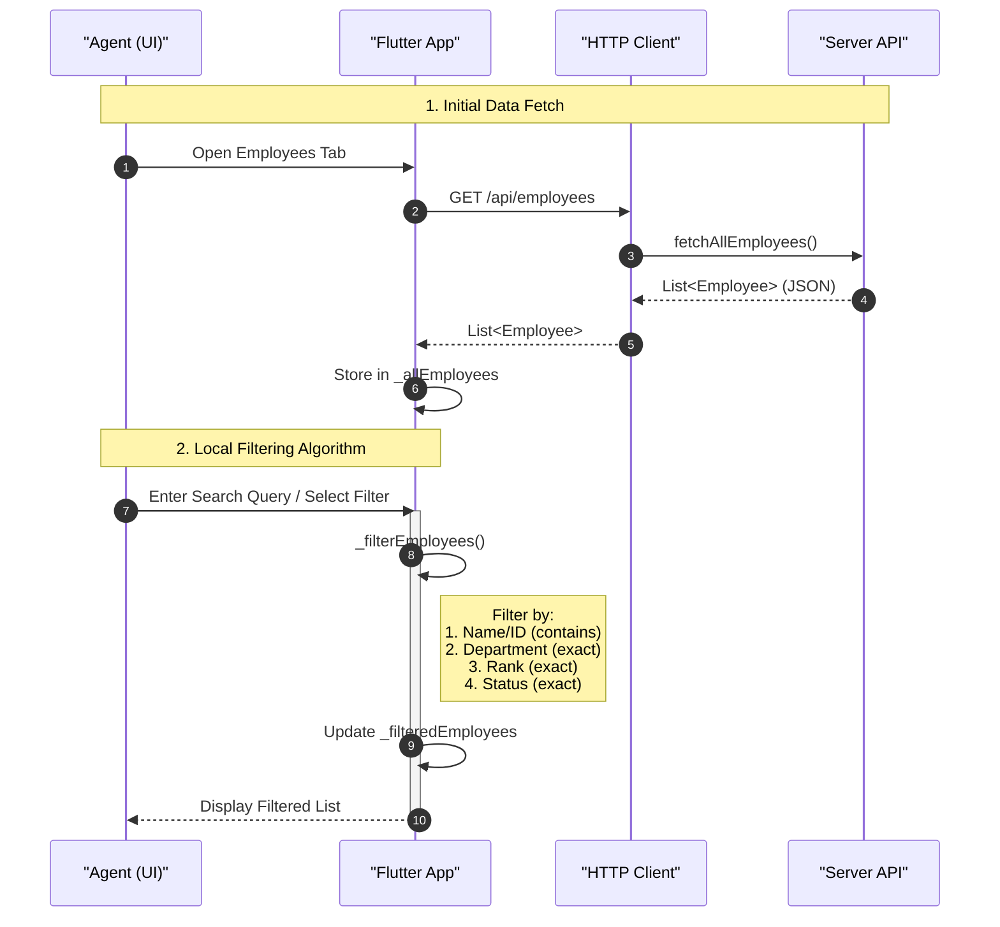

### 4.5 Request Retirement (PM)
Sequence diagram for a Project Manager initiating a retirement request for an employee.

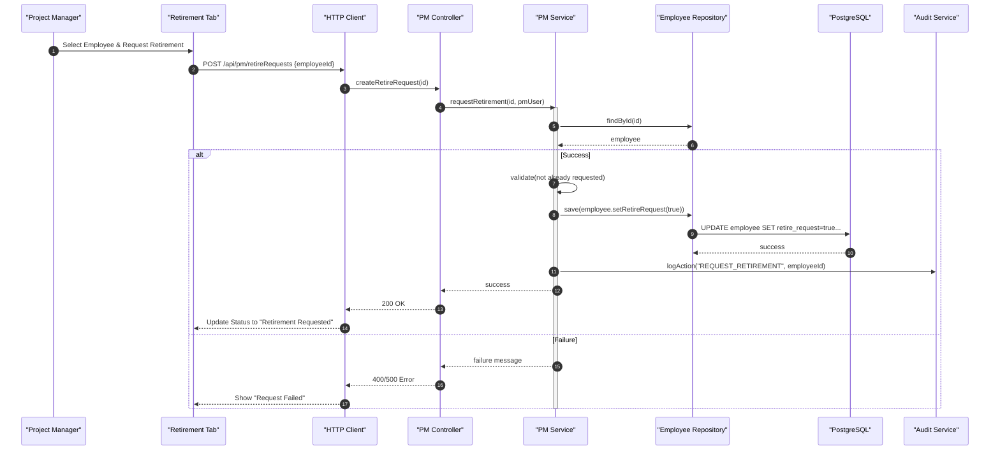

### 4.6 Validate Retirement Request (ASM)
Sequence diagram for the validation of a retirement request.

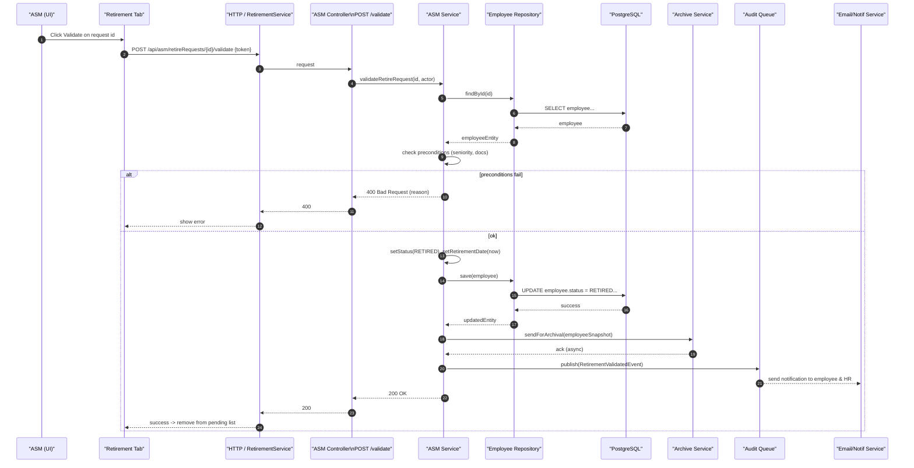

### 4.7 Create Body (Agent)
Sequence diagram for an Agent creating a new organizational body.

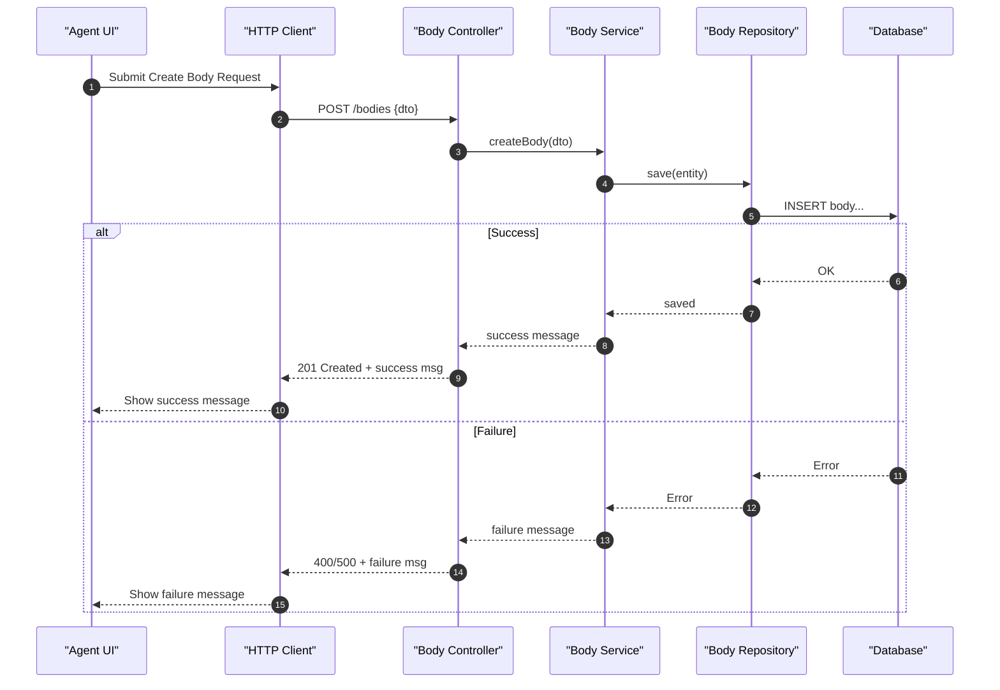

### 4.8 Department Change
Sequence diagram for changing an employee's department.

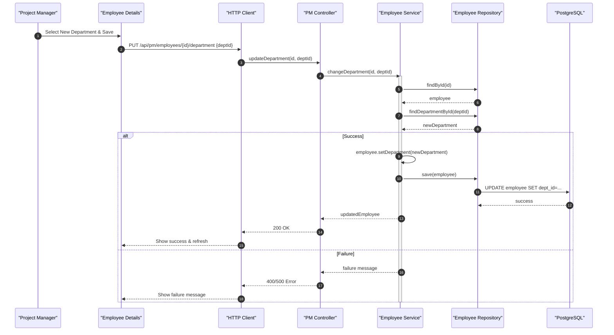

### 4.9 Modify Retired Employee
Sequence diagram for modifying a retired employee's information, requiring a Director's code for authorization.

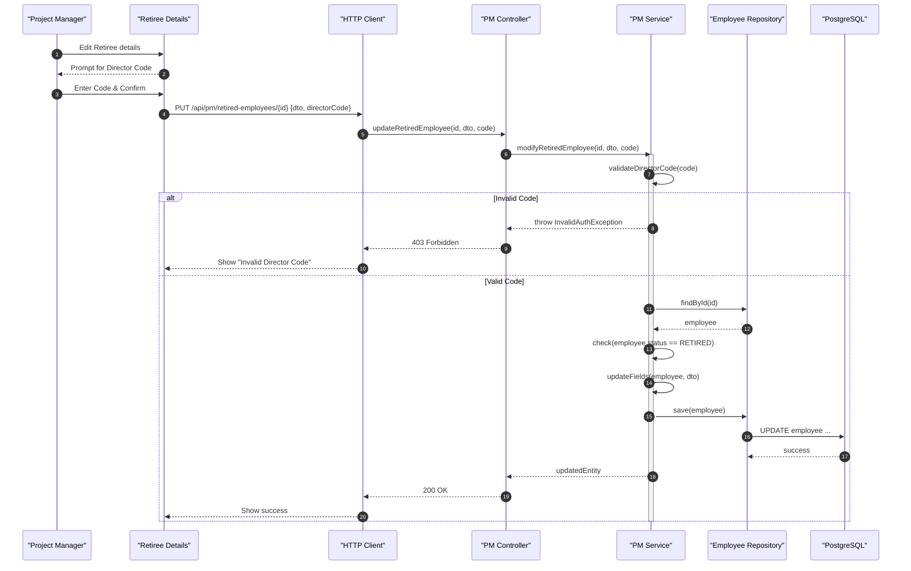

### 4.10 Document Extraction
#### 4.10.1 List of Workers
Sequence diagram for generating the full list of employees.

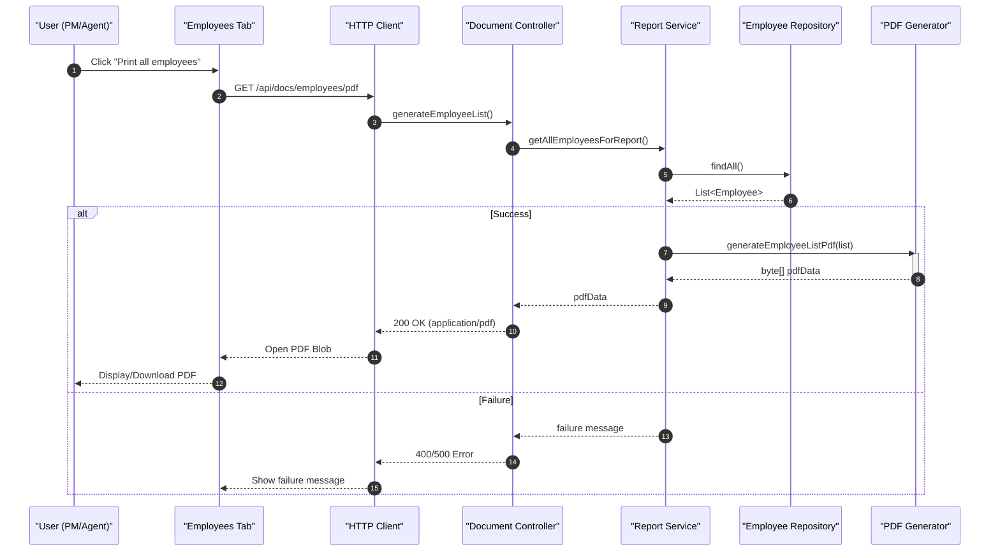

#### 4.10.2 Work Certificate
Sequence diagram for generating a work certificate for an active employee.

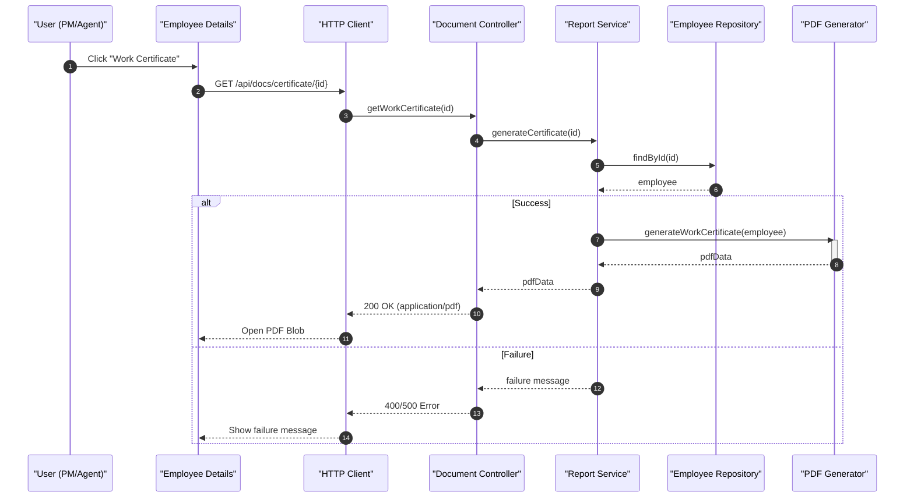

#### 4.10.3 Work Certificate (Retiree)
Sequence diagram for generating a certificate for a retired employee.

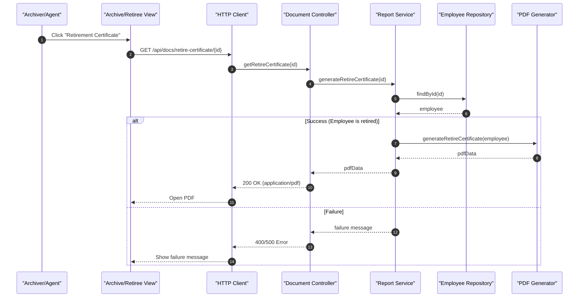

## 5. Deployment Diagram
Illustrates the physical architecture of the system including the Spring Boot backend and PostgreSQL database.

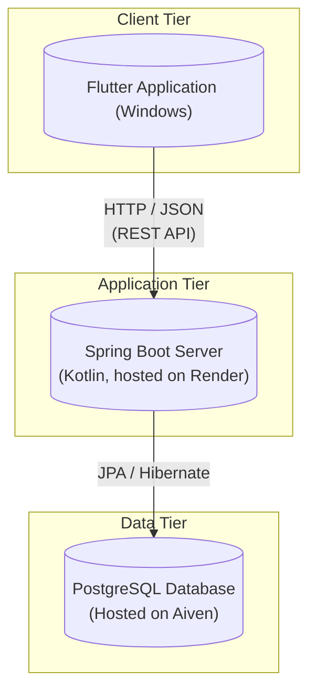
