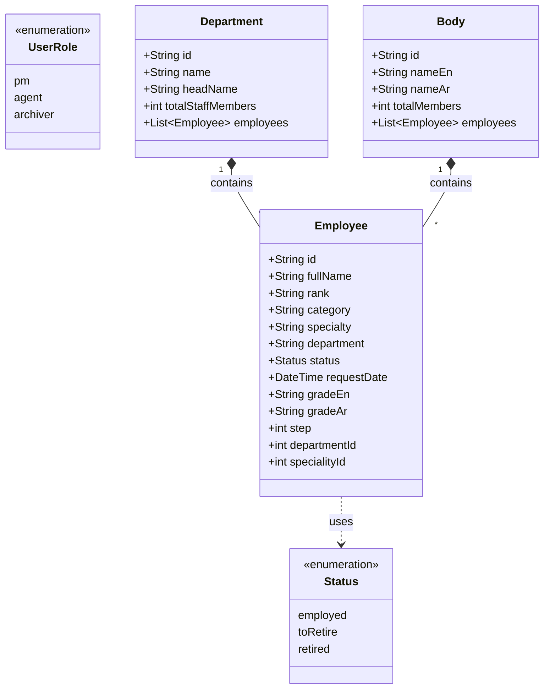

# Chapter 2: Modeling

## 1. Introduction
This chapter presents the static and dynamic views of the system using Unified Modeling Language (UML) diagrams.

## 2. Use Case Diagram
The following diagram illustrates the interactions between the primary actors (PM, Agent, Archiver) and the system's main use cases.

## 3. Class Diagram
This diagram represents the internal structure of the system, matching the actual data models implemented in the Flutter code (`lib/classes/`).

## 4. Sequence Diagrams

### 4.1 Authentication Process
Sequence diagram for the login flow utilizing `AuthService`.

### 4.2 Add Employee Process
Sequence diagram for adding a new employee involving the `EmployeeService` and REST API.

## 5. Deployment Diagram
Illustrates the physical architecture of the system.

