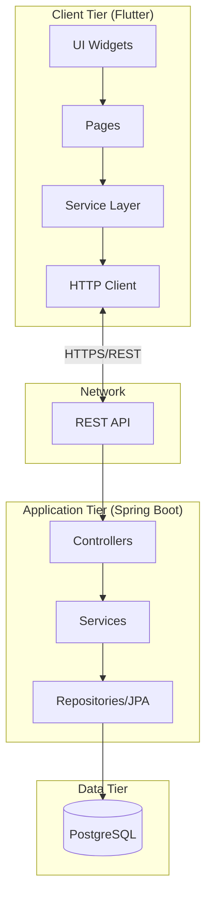
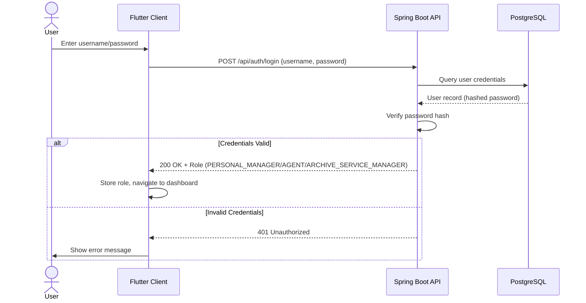

# Chapter 3: Implementation

## 1. Introduction

This chapter details the technical realization of the Human Resources Management System (HMRS), covering the choice of application type, technologies used for production, justification for technology decisions, and security mechanisms implemented. The HRMS is developed as a **cross-platform desktop and mobile application** to meet the operational needs of the Algerian Land Registry Administration.

### 1.1 Choice of Application Type

We have developed a **hybrid application** using Flutter, which offers the following advantages over a traditional website:

| Criteria | Application (Flutter) | Traditional Website |
|----------|----------------------|---------------------|
| **Offline Capability** | Partial offline functionality with cached data | Requires constant internet connection |
| **Performance** | Native compilation provides smooth 60fps UI | Limited by browser rendering engine |
| **Platform Reach** | Single codebase deploys to Windows, Android, Web, macOS, iOS | Requires separate mobile adaptation |
| **Native Features** | Direct access to file system for PDF generation and printing | Limited browser sandbox access |
| **User Experience** | Rich, responsive interfaces with platform-specific design | Constrained by web standards |
| **Security** | Compiled binary code harder to reverse engineer | JavaScript source visible to users |

The choice of a Flutter application is justified by the **administrative nature of the system**, which requires:
- **Desktop deployment** for office use on Windows workstations
- **PDF generation and printing** capabilities for official documents
- **Rich data entry forms** with real-time validation
- **Role-based access** from a single unified interface

---

## 2. Technologies Used for Production

### 2.1 Frontend Technology Stack

| Technology | Version | Purpose |
|------------|---------|---------|
| **Flutter SDK** | ^3.8.1 | Cross-platform UI framework |
| **Dart** | ^3.0 | Programming language |
| **go_router** | ^17.0.0 | Declarative routing and navigation |
| **http** | ^1.2.0 | HTTP client for REST API communication |
| **pdf** | ^3.11.1 | PDF document generation |
| **printing** | ^5.13.3 | Cross-platform print functionality |
| **intl** | ^0.20.2 | Internationalization and date formatting |
| **path_provider** | ^2.1.4 | Access to device file system directories |
| **popover** | ^0.3.1 | Popup menu components |

### 2.2 Backend Technology Stack

| Technology | Version | Purpose |
|------------|---------|---------|
| **Spring Boot** | 3.0+ | Java/Kotlin web framework |
| **Kotlin** | 1.8+ | Backend programming language |
| **Gradle (Kotlin DSL)** | Latest | Build automation tool |
| **Spring Data JPA** | Included | Object-Relational Mapping |
| **Hibernate Validator** | Included | Bean validation framework |
| **PostgreSQL** | 15+ | Production relational database |
| **H2 Database** | Embedded | Development/testing database |

### 2.3 Infrastructure & DevOps

| Component | Technology | Purpose |
|-----------|------------|---------|
| **Backend Hosting** | Render.com | Cloud platform for Spring Boot API |
| **Database Hosting** | Render PostgreSQL | Managed database service |
| **Version Control** | Git / GitHub | Source code management |
| **IDE** | Visual Studio Code | Development environment |
| **API Testing** | Postman / Browser DevTools | Endpoint verification |
| **Documentation** | Mermaid.js | UML diagram generation |

### 2.4 API Endpoints Structure

The backend exposes RESTful endpoints organized by user role:

```
Base URL: https://hr-server-3s0m.onrender.com

Authentication Endpoints (/api/auth):
  POST /login                    - User authentication
  POST /reset-password           - Password reset with director's code

Personnel Manager Endpoints (/api/pm):
  GET  /employees                - List all active employees
  POST /employees/add            - Create new employee
  PUT  /employees/{id}/modify    - Modify employee details
  DELETE /employees/{id}         - Remove employee

Archive Service Manager Endpoints (/api/asm):
  GET  /retireRequests           - List retirement requests
  PUT  /employees/{id}/modify    - Modify archived employee records
```

---

## 3. Technology Justification

### 3.1 Why Flutter for Frontend?

| Justification | Explanation |
|---------------|-------------|
| **Single Codebase, Multi-Platform** | The HR system runs on Windows desktops (primary), Android tablets (field use), and web browsers—Flutter compiles from one Dart codebase to all platforms |
| **Rich UI Components** | Material Design widgets provide polished, consistent interfaces for complex data entry forms required by HR functions |
| **Hot Reload** | Rapid development iteration with instant UI updates during development |
| **PDF Generation** | The `pdf` and `printing` packages enable native document creation for employee records, reports, and certificates |
| **Type Safety** | Dart's static typing catches errors at compile time, essential for data-sensitive HR applications |
| **Performance** | Compiled to native ARM/x64 code, avoiding JavaScript bridge overhead |

### 3.2 Why Spring Boot (Kotlin) for Backend?

| Justification | Explanation |
|---------------|-------------|
| **Enterprise-Grade Framework** | Spring Boot provides robust dependency injection, security, and data access layers ideal for government administration systems |
| **Kotlin Advantages** | Null safety, concise syntax, and modern language features reduce boilerplate and potential runtime errors |
| **Spring Data JPA** | Simplifies database operations with repository patterns and automatic query generation |
| **Validation Framework** | Built-in `@Valid` annotations with Hibernate Validator ensure data integrity at the API level |
| **Scalability** | Stateless REST architecture allows horizontal scaling on cloud platforms |
| **Security Integration** | Spring Security provides out-of-the-box authentication and authorization mechanisms |

### 3.3 Why PostgreSQL for Database?

| Justification | Explanation |
|---------------|-------------|
| **ACID Compliance** | Full transaction support essential for HR data integrity |
| **Relational Model** | Complex relationships (Employee → Department → Body) map naturally to relational tables |
| **JSON Support** | PostgreSQL's JSONB type offers flexibility for storing semi-structured data |
| **Open Source** | No licensing costs for government deployments |
| **Cloud Integration** | Native support on Render.com with automatic backups |

### 3.4 Why Render.com for Hosting?

| Justification | Explanation |
|---------------|-------------|
| **Free Tier Availability** | Suitable for academic projects and prototyping |
| **Automatic Deployments** | Git-based continuous deployment from repository |
| **Managed PostgreSQL** | Database hosting with automatic backups |
| **HTTPS by Default** | All endpoints secured with TLS certificates |
| **Zero Configuration Scaling** | Simple vertical scaling when needed |

---

## 4. Software Architecture

### 4.1 Client-Server Architecture Diagram



### 4.2 Frontend Architecture

The Flutter client follows a **Service-Oriented Architecture**:

| Layer | Components | Responsibility |
|-------|------------|----------------|
| **Presentation** | `AuthinticationDialog`, `SideBar`, `EmployeeList` | UI rendering and user interaction |
| **Pages** | `Loginpage`, `Homepage` | Route-level containers |
| **Services** | `AuthService`, `EmployeeService`, `PdfService` | Business logic and API communication |
| **Models** | `Employee`, `Department`, `Body`, `Grade` | Data structure definitions |

### 4.3 Backend Architecture

The Spring Boot backend implements a **Layered Architecture**:

| Layer | Components | Responsibility |
|-------|------------|----------------|
| **Controller** | `AuthController`, `PMController`, `ASMController` | HTTP request handling |
| **Service** | `AuthService`, `EmployeeService` | Business logic implementation |
| **Repository** | `EmployeeRepository`, `UserRepository` | Database access via JPA |
| **DTO** | `EmployeeDTOPM`, `LoginRequest`, `ASMModifyEmployeeRequest` | API contract definitions |
| **Entity** | `Employee`, `User` | Database table mappings |

---

## 5. Security Mechanisms

### 5.1 Authentication System

The HRMS implements a **credential-based authentication system** with the following flow:



### 5.2 Password Security

| Mechanism | Implementation | Purpose |
|-----------|----------------|---------|
| **Password Hashing** | BCrypt algorithm via Spring Security | Passwords are never stored in plaintext; BCrypt includes salt and is computationally expensive to prevent brute-force attacks |
| **Password Reset** | Director's code verification via `/api/auth/reset-password` | Password changes require manager-level authorization |
| **Input Trimming** | `username.trim()` and `password.trim()` in `AuthService` | Prevents accidental whitespace issues |

### 5.3 Role-Based Access Control (RBAC)

The system enforces access based on three user roles:

| Role | Code | Permissions |
|------|------|-------------|
| **Personnel Manager (PM)** | `PERSONAL_MANAGER` | Full employee CRUD, view all departments/bodies, modify grades |
| **Agent** | `AGENT` | Read-only access to employee lists, generate reports |
| **Archive Service Manager (ASM)** | `ARCHIVE_SERVICE_MANAGER` | Manage retirement requests, modify archived records (requires Director's Code) |

> [!IMPORTANT]
> Sensitive operations on archived employee records require an additional **Director's Code** verification, providing two-factor authorization for critical modifications.

### 5.4 Network Security

| Mechanism | Implementation | Purpose |
|-----------|----------------|---------|
| **HTTPS Encryption** | TLS certificates via Render.com | All client-server communication is encrypted in transit |
| **CORS Policy** | Spring Security configuration | Restricts API access to authorized origins only |
| **Request Timeout** | 60-second timeout in `EmployeeService` | Prevents DoS through long-running requests |
| **JSON Content-Type** | `Content-Type: application/json` headers | Prevents MIME-type attacks |

### 5.5 Input Validation & Sanitization

| Layer | Mechanism | Example |
|-------|-----------|---------|
| **Frontend** | Form validation via `TextFormField.validator` | Required fields, format checks before submission |
| **Backend** | Bean Validation (`@Valid`, `@NotNull`, `@Size`) | Entity-level constraints enforced by Hibernate Validator |
| **Database** | PostgreSQL constraints | `NOT NULL`, `CHECK`, foreign key constraints |

### 5.6 Director's Code Authorization

For sensitive operations (password reset, archived record modification), the system implements a **secondary authorization layer**:

```dart
// From auth_service.dart - Password reset requires director's code
static Future<bool> resetPassword(String directorsCode, String username, String newPassword) async {
  final response = await http.post(
    Uri.parse('$baseUrl/reset-password'),
    body: json.encode({
      'directorsCode': directorsCode,
      'username': username,
      'newPassword': newPassword,
    }),
  );
  return response.statusCode == 200;
}
```

This mechanism ensures that even authenticated users cannot perform critical operations without explicit management approval.

---

## 6. Conclusion

The implementation of the HMRS demonstrates a robust full-stack architecture using modern technologies:

- **Flutter** provides a single codebase deployable to Windows desktops, Android devices, and web browsers, with rich UI components and native PDF generation capabilities essential for administrative workflows.

- **Spring Boot with Kotlin** delivers a scalable, type-safe backend with enterprise-grade security features and seamless PostgreSQL integration via Spring Data JPA.

- **Security** is enforced at multiple layers: password hashing with BCrypt, role-based access control, HTTPS encryption, input validation, and secondary director's code authorization for sensitive operations.

- **Cloud deployment** on Render.com enables automatic deployments, managed database services, and TLS encryption without infrastructure management overhead.

This architecture balances **developer productivity** (single codebase, type safety, hot reload) with **operational requirements** (cross-platform deployment, document generation, secure data handling) appropriate for a government human resources system.
