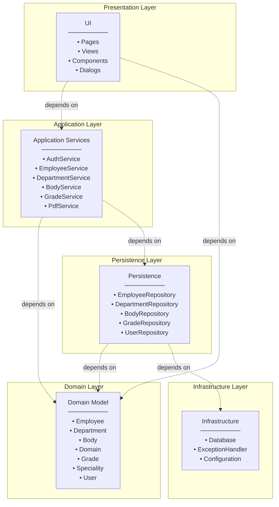
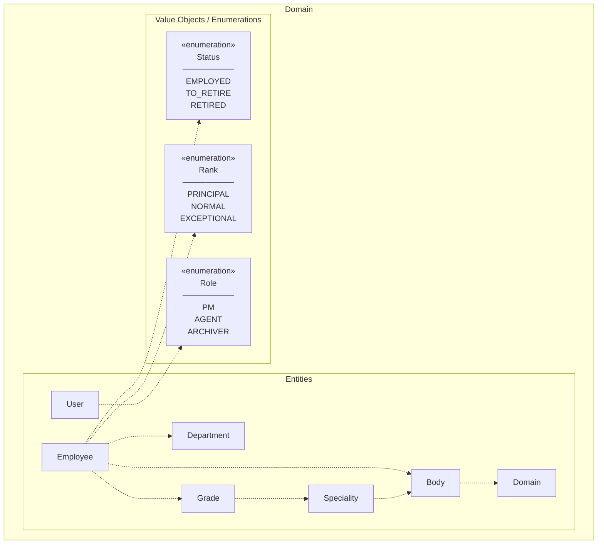
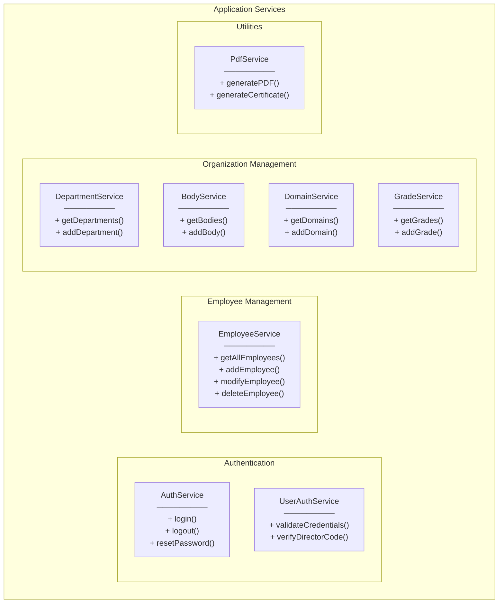

# Package Diagram - Human Resource Management System

This document presents the UML Package Diagram for the HR Management System, showing the **logical organization** of the system with package dependencies between layers.

---

## Complete Package Diagram

```mermaid
graph TB
    subgraph HRManagement["HRManagement"]
        direction TB
        
        subgraph UILayer["UI"]
            Pages["Pages<br/>─────────<br/>LoginPage<br/>HomePage"]
            Views["Views<br/>─────────<br/>EmployeesView<br/>DepartmentsView<br/>BodiesView<br/>RetirementView<br/>RequestsView<br/>DomainsView<br/>GradesView"]
            Components["Components<br/>─────────<br/>SideBar<br/>EmployeesTable<br/>StatusChip<br/>Cards<br/>Dialogs"]
        end
        
        subgraph AppLayer["Application Services"]
            AuthService["AuthService"]
            EmployeeService["EmployeeService"]
            DepartmentService["DepartmentService"]
            BodyService["BodyService"]
            DomainService["DomainService"]
            GradeService["GradeService"]
            SpecialityService["SpecialityService"]
            PdfService["PdfService"]
        end
        
        subgraph DomainLayer["Domain Model"]
            EmployeeEntity["Employee"]
            DepartmentEntity["Department"]
            BodyEntity["Body"]
            DomainEntity["Domain"]
            GradeEntity["Grade"]
            SpecialityEntity["Speciality"]
            UserEntity["User"]
            Enums["«enumeration»<br/>Status<br/>Role<br/>Rank"]
        end
        
        subgraph PersistenceLayer["Persistence"]
            EmployeeRepository["EmployeeRepository"]
            DepartmentRepository["DepartmentRepository"]
            BodyRepository["BodyRepository"]
            DomainRepository["DomainRepository"]
            GradeRepository["GradeRepository"]
            SpecialityRepository["SpecialityRepository"]
            UserRepository["UserRepository"]
        end
        
        subgraph InfraLayer["Infrastructure"]
            DatabaseConfig["DatabaseConfig"]
            ExceptionHandler["ExceptionHandler"]
            APIConfig["APIConfig"]
        end
    end
    
    %% Dependencies (dashed arrows)
    UILayer -.->|uses| AppLayer
    UILayer -.->|displays| DomainLayer
    AppLayer -.->|manipulates| DomainLayer
    AppLayer -.->|calls| PersistenceLayer
    PersistenceLayer -.->|persists| DomainLayer
    PersistenceLayer -.->|uses| InfraLayer
    AppLayer -.->|uses| InfraLayer
```

---

## Layered Architecture View

---

## Domain Package Details

---

## Application Services Package Details

---

## Package Dependencies Summary

| Package | Depends On | Description |
|---------|------------|-------------|
| **UI** | Application Services, Domain | User interface layer displaying domain data |
| **Application Services** | Domain, Persistence | Business logic and use case orchestration |
| **Domain** | - | Core business entities and enumerations |
| **Persistence** | Domain, Infrastructure | Data access repositories |
| **Infrastructure** | - | Cross-cutting concerns (DB, Config, Exceptions) |

---

## Notation Legend

| Symbol | Meaning |
|--------|---------|
| `-.->` | Dependency (dashed arrow) |
| `«enumeration»` | Stereotype for enum types |
| Package box | Logical grouping of related elements |
| Nested package | Sub-package within parent package |
