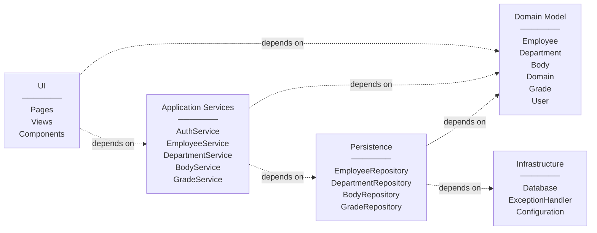
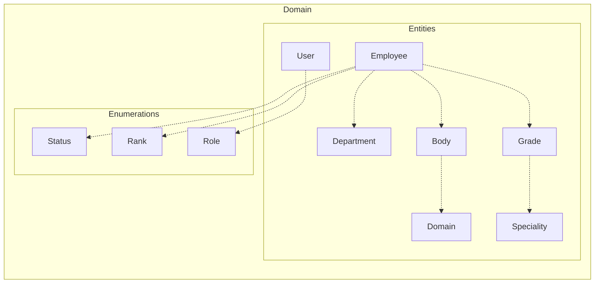
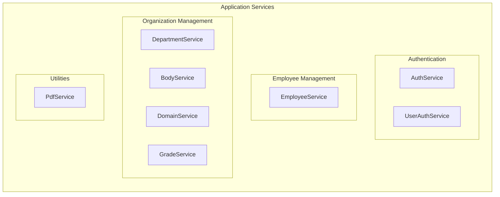

# Package Diagram - Human Resource Management System

This document presents the UML Package Diagram for the HR Management System, showing the **logical organization** of the system with package dependencies between layers.

---

## Complete Package Diagram

```mermaid
graph LR
    subgraph UILayer["UI"]
        Pages["Pages"]
        Views["Views"]
        Components["Components"]
    end
    
    subgraph AppLayer["Application Services"]
        AuthService["AuthService"]
        EmployeeService["EmployeeService"]
        DepartmentService["DepartmentService"]
        BodyService["BodyService"]
        DomainService["DomainService"]
        GradeService["GradeService"]
        PdfService["PdfService"]
    end
    
    subgraph DomainLayer["Domain Model"]
        EmployeeEntity["Employee"]
        DepartmentEntity["Department"]
        BodyEntity["Body"]
        DomainEntity["Domain"]
        GradeEntity["Grade"]
        SpecialityEntity["Speciality"]
        UserEntity["User"]
        Enums["Status / Role / Rank"]
    end
    
    subgraph PersistenceLayer["Persistence"]
        EmployeeRepo["EmployeeRepository"]
        DepartmentRepo["DepartmentRepository"]
        BodyRepo["BodyRepository"]
        DomainRepo["DomainRepository"]
        GradeRepo["GradeRepository"]
        UserRepo["UserRepository"]
    end
    
    subgraph InfraLayer["Infrastructure"]
        DatabaseConfig["DatabaseConfig"]
        ExceptionHandler["ExceptionHandler"]
        APIConfig["APIConfig"]
    end

    UILayer -.-> AppLayer
    UILayer -.-> DomainLayer
    AppLayer -.-> DomainLayer
    AppLayer -.-> PersistenceLayer
    PersistenceLayer -.-> DomainLayer
    PersistenceLayer -.-> InfraLayer
```

---

## Layered Architecture View

---

## Domain Package Details

---

## Application Services Package Details

---

## Package Dependencies Summary

| Package | Depends On | Description |
|---------|------------|-------------|
| **UI** | Application Services, Domain | User interface layer |
| **Application Services** | Domain, Persistence | Business logic layer |
| **Domain** | - | Core entities and enumerations |
| **Persistence** | Domain, Infrastructure | Data access layer |
| **Infrastructure** | - | Cross-cutting concerns |

---

## Notation Legend

| Symbol | Meaning |
|--------|---------|
| `-.->` | Dependency (dashed arrow) |
| Package box | Logical grouping of related elements |
