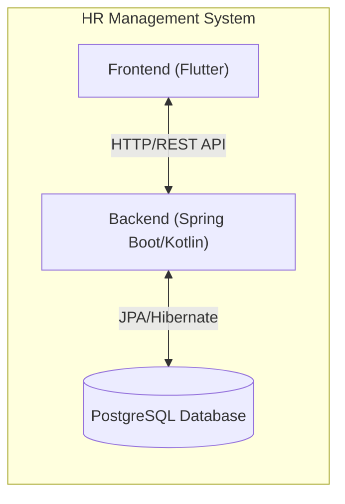
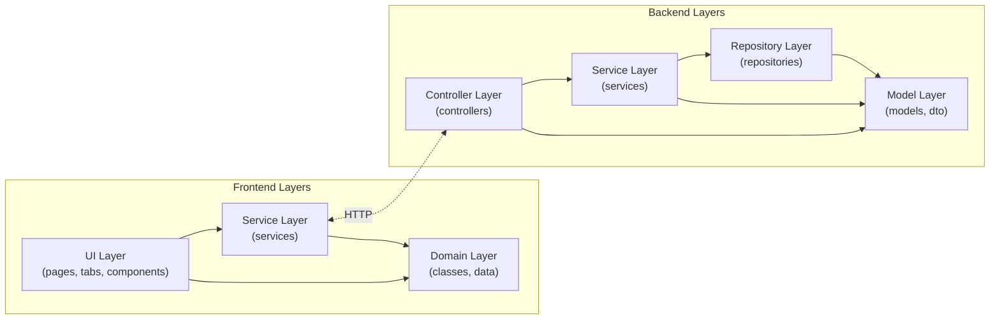
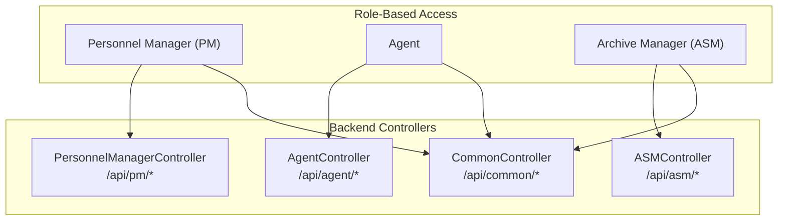

# Package Diagram - Human Resource Management System

This document presents the package diagram for the complete HR Management System, showing both the **Flutter Frontend** and **Spring Boot Backend** architectures and their relationships.

----

## System Overview

---

## Complete Package Diagram

```mermaid
graph TB
    subgraph Frontend["Frontend - Flutter Application"]
        direction TB
        
        subgraph FE_UI["ui"]
            subgraph FE_Pages["pages"]
                LoginPage["LoginPage"]
                HomePage["HomePage"]
            end
            
            subgraph FE_Tabs["tabs"]
                EmployeesTab["EmployeesTab"]
                DepartmentsTab["DepartmentsTab"]
                BodiesTab["BodiesTab"]
                RetirementTab["RetirementTab"]
                RequestsTab["RequestsTab"]
                DomainsTab["DomainsTab"]
                GradesTab["GradesTab"]
                ExtendedBodiesTab["ExtendedBodiesTab"]
                ExtendedDepartmentsTab["ExtendedDepartmentsTab"]
                ExtendedGradesTab["ExtendedGradesTab"]
            end
            
            subgraph FE_Components["components"]
                SideBar["SideBar"]
                EmployeesTable["EmployeesTable"]
                StatusChip["StatusChip"]
                DepartmentCard["DepartmentCard"]
                BodieCard["BodieCard"]
                DomainCard["DomainCard"]
                AuthDialog["AuthinticationDialog"]
                AddEmployeeDialog["AddEmployeeDialog"]
                ModifyEmployeeDialog["ModifyEmployeeDialog"]
                ModifyRetireeDialog["ModifyRetireeDialog"]
                ForgotPasswordDialog["ForgotPasswordDialog"]
            end
        end
        
        subgraph FE_Services["services"]
            AuthService["auth_service"]
            EmployeeService["employee_service"]
            DepartmentService["department_service"]
            BodyService["body_service"]
            DomainService["domain_service"]
            GradeService["grade_service"]
            SpecialityService["speciality_service"]
            PdfService["pdf_service"]
        end
        
        subgraph FE_Domain["domain"]
            subgraph FE_Classes["classes"]
                Employee["Employee"]
                Department["Department"]
                Body["Body"]
                Domain["Domain"]
                Grade["Grade"]
                Speciality["Speciality"]
                Types["types (User, Status)"]
            end
            
            subgraph FE_Data["data"]
                AppData["data.dart"]
            end
        end
    end
    
    subgraph Backend["Backend - Spring Boot (Kotlin)"]
        direction TB
        
        subgraph BE_Controllers["controllers"]
            ASMController["ASMController"]
            AgentController["AgentController"]
            PMController["PersonnelManagerController"]
            AuthController["AuthController"]
            CommonController["CommonController"]
        end
        
        subgraph BE_Services["services"]
            ASMService["ASMService"]
            AgentService["AgentService"]
            PMService["PersonnelManagerService"]
            UserAuthService["UserAuthService"]
            CommonService["CommonService"]
        end
        
        subgraph BE_DTOs["dto"]
            EmployeeDTOPM["EmployeeDTOPM"]
            BodyDTO["BodyDTO"]
            GradeDTO["GradeDTO"]
        end
        
        subgraph BE_Models["models"]
            BE_Employee["Employee"]
            BE_Department["Department"]
            BE_Body["Body"]
            BE_Domain["Domain"]
            BE_Grade["Grade"]
            BE_Speciality["Speciality"]
            BE_User["User"]
            BE_Role["Role"]
            BE_Rank["Rank"]
            BE_Status["Status"]
        end
        
        subgraph BE_Repositories["repositories"]
            EmployeeRepo["EmployeeRepository"]
            DepartmentRepo["DepartmentRepository"]
            BodyRepo["BodyRepository"]
            DomainRepo["DomainRepository"]
            GradeRepo["GradeRepository"]
            SpecialityRepo["SpecialityRepository"]
            UserRepo["UserRepository"]
        end
        
        subgraph BE_Core["core"]
            HrServerApp["HrServerApplication"]
            DbInit["DatabaseInitializer"]
            Exceptions["Exceptions"]
            ExHandler["GlobalExceptionHandler"]
        end
    end
    
    subgraph Database["PostgreSQL Database"]
        direction TB
        DB_Tables[("employees<br/>departments<br/>bodies<br/>domains<br/>grades<br/>specialities<br/>users")]
    end

    %% Frontend internal dependencies
    FE_Pages --> FE_Tabs
    FE_Pages --> FE_Components
    FE_Tabs --> FE_Components
    FE_Tabs --> FE_Services
    FE_Components --> FE_Services
    FE_Components --> FE_Classes
    FE_Services --> FE_Classes
    FE_Tabs --> FE_Classes
    FE_Data --> FE_Classes
    
    %% Backend internal dependencies
    BE_Controllers --> BE_Services
    BE_Controllers --> BE_DTOs
    BE_Services --> BE_Repositories
    BE_Services --> BE_Models
    BE_DTOs --> BE_Models
    BE_Repositories --> BE_Models
    BE_Core --> BE_Models
    
    %% Cross-layer communication
    FE_Services <-.->|REST API| BE_Controllers
    BE_Repositories <-.->|JPA| Database
```

---

## Frontend Package Structure

| Package | Description | Key Files |
|---------|-------------|-----------|
| **pages** | Main application screens | `LoginPage`, `HomePage` |
| **tabs** | Content tabs for different modules | `EmployeesTab`, `DepartmentsTab`, `RequestsTab`, etc. |
| **components** | Reusable UI widgets | `SideBar`, `EmployeesTable`, `StatusChip`, dialogs |
| **services** | API communication layer | `employee_service`, `auth_service`, `pdf_service`, etc. |
| **classes** | Domain models | `Employee`, `Department`, `Body`, `Domain`, `Grade` |
| **data** | Application state | `data.dart` (global state) |

---

## Backend Package Structure

| Package | Description | Key Files |
|---------|-------------|-----------|
| **controllers** | REST API endpoints | `ASMController`, `PMController`, `AgentController` |
| **services** | Business logic layer | `ASMService`, `PersonnelManagerService`, `AgentService` |
| **dto** | Data Transfer Objects | `EmployeeDTOPM`, `BodyDTO`, `GradeDTO` |
| **models** | JPA entities | `Employee`, `Department`, `Body`, `User`, `Role` |
| **repositories** | Data access layer | `EmployeeRepository`, `DepartmentRepository`, etc. |
| **core** | Application setup | `HrServerApplication`, `DatabaseInitializer` |

---

## Layer Dependencies

---

## User Role Access Mapping

---

## Technology Stack Summary

| Layer | Technology |
|-------|------------|
| **Frontend** | Flutter (Dart) |
| **Backend** | Spring Boot (Kotlin) |
| **Database** | PostgreSQL |
| **API** | REST (JSON) |
| **ORM** | Spring Data JPA / Hibernate |
